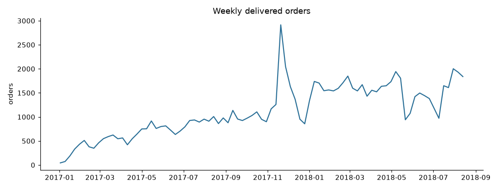
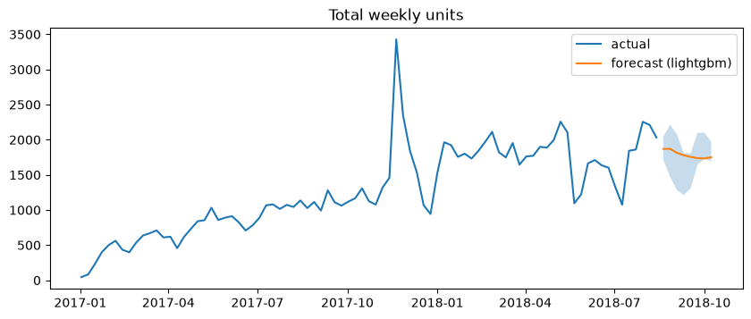
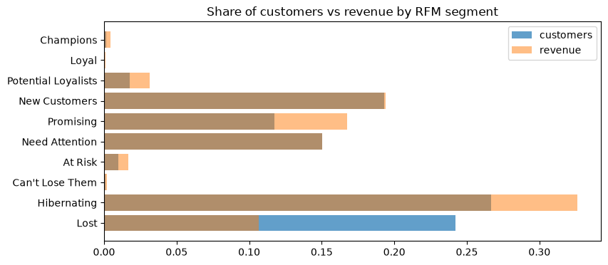
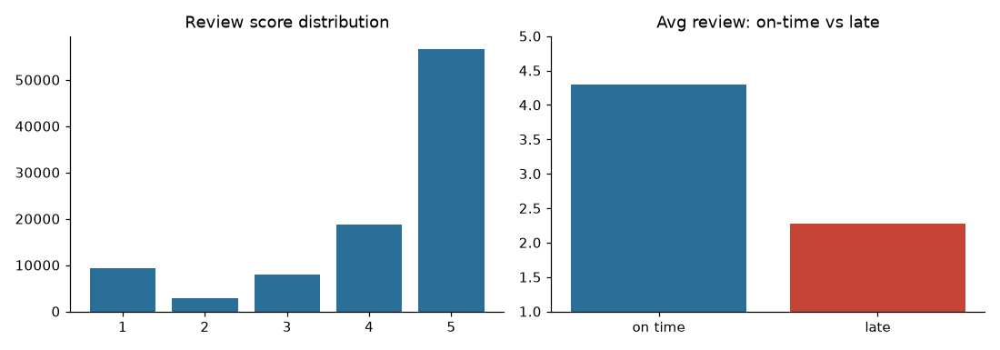

# Intelligent E-Commerce Demand Forecasting & Customer Analytics System

**Capstone project report** · Dataset: Olist Brazilian E-Commerce (Kaggle, `olistbr/brazilian-ecommerce`)

---

## 1. Abstract

This project builds an end-to-end analytics system for a multi-seller marketplace. It covers two areas: (1) forecasting **weekly unit demand** for the top 15 product categories and the whole store, and (2) understanding **customers** through RFM segmentation, behavioural clustering, repeat-purchase (churn) propensity and 12-month customer lifetime value (CLV). A reproducible pipeline turns the raw CSVs into a star-schema warehouse, trains and backtests the models, and publishes the results. A FastAPI service and a five-page Streamlit dashboard serve them.

Headline results on held-out data:

- **Forecasting:** the best model per series reaches a mean **WAPE of 22.3%**, against 27.2% for a naive last-value forecast (−18% error). Total-store demand is forecast at **13.5% WAPE**, against 19.2% for naive.
- **Customers:** 97% of Olist customers buy exactly once. Repeat purchase is therefore close to unpredictable (test ROC-AUC 0.57). Even so, the model targets repeat buyers at **1.7× the base rate** in its top decile, and its probabilities are calibrated (mean predicted 1.15% vs observed 1.17%).
- **Operations:** late deliveries are the strongest driver of customer dissatisfaction. The average review is **2.27 for late orders vs 4.29 for on-time orders**.

## 2. Problem statement

A marketplace operator needs to:

1. **Plan inventory, seller onboarding and logistics capacity**, which requires short-term demand forecasts by category with uncertainty bands.
2. **Allocate retention and marketing budget**, which requires knowing which customers are valuable, which are likely to come back, and which segments exist.
3. **Find operational levers**, which requires knowing where delivery performance hurts satisfaction and which categories are bought together.

## 3. Data

| Table | Rows | Used for |
|---|---:|---|
| orders | 99,441 | timestamps, status, delivery dates |
| order_items | 112,650 | units, price, freight, product, seller |
| customers | 99,441 | `customer_unique_id`, state |
| payments | 103,886 | payment value, type, installments |
| reviews | 99,224 | review score |
| products (+ translation) | 32,951 | category (English) |
| sellers, geolocation | 3,095 / 1,000,163 | (context; not modelled) |

**Cleaning decisions** (`src/ecom/data/clean.py`):

- Only **delivered** orders are kept (97% of orders). Canceled or unavailable orders are not realised demand.
- **Analysis window: 2017-01-01 → 2018-08-19.** 2016 has fewer than 350 orders, and order volume collapses from about 2018-08-20. Across all statuses, the week of 20 August has 1,071 orders against about 1,900 in each prior week, which is an artefact of when the extract was taken. Leaving that week in produced a false "demand crash" at the end of the series.
- **One row per order** for reviews (latest answer kept) and payments (summed across payment rows).
- `customer_id` is issued per order in Olist. The real person is **`customer_unique_id`**, and all customer analytics use it.

After cleaning: **95,041 orders, 91,977 customers, R$15.2M revenue**, average order value R$160, 3.0% repeat customers, average review 4.15, 6.8% late deliveries.



## 4. System architecture

```
data/raw/olist/*.csv
      │  load.py (typed, dates parsed) → clean.py (rules above)
      ▼
warehouse.py ── fact_order_items · fact_orders · dim_customer · dim_product · dim_date  (parquet)
      │
      ├── forecasting/  weekly panel → baselines · ETS · ARIMA · LightGBM · ensemble → backtest → forecast
      ├── features/customer.py → segmentation/ (RFM, K-Means) · churn/ (propensity) · clv/
      └── insights/  category affinity · state performance · EDA
      ▼
data/processed/*.parquet + models/*.joblib   ← written only by the pipeline
      │
      ├── FastAPI  (src/ecom/api)       read-only, cached
      └── Streamlit (src/ecom/dashboard) read-only, cached
```

Design principles:

- **Training never happens at request time.** The pipeline (`make pipeline`, about 35 s on the full data) writes artefacts, and the serving layers only read them.
- **Point-in-time correctness.** Customer features take a `snapshot` date and ignore later orders. Churn labels come strictly from the window after it.
- **Reproducible and testable.** Every path resolves through `config.py`. The test suite (35 tests, run by GitHub Actions CI on Python 3.11 and 3.12) runs the whole pipeline, the API and every dashboard page on a synthetic dataset with the exact Olist schema, so the tests never touch real data.

## 5. Demand forecasting

### 5.1 Setup

- **Target:** weekly item units (Monday-start weeks) for the top 15 categories by volume, plus the store total. That gives 16 series of 85 weeks each.
- **Horizon:** 8 weeks.
- **Validation:** a 3-fold expanding-window backtest whose last three non-overlapping 8-week blocks serve as test sets. Metrics are WAPE (primary: scale-free and robust to low-volume weeks), sMAPE, MAE, RMSE and bias.

### 5.2 Models

| Model | Idea |
|---|---|
| naive | last observed week |
| seasonal naive | same week last year |
| moving average (4) | mean of last 4 weeks |
| damped ETS | Holt's linear trend with damping, on log1p |
| ARIMA(1,1,1) | on log1p (too little history for a 52-week seasonal term) |
| **LightGBM (global)** | one model across all series. Features: lags 1–4, 8, 12; rolling mean/std; week-of-year, month, Brazilian holidays, Black Friday week and the week after, Christmas; series id. Recursive multi-step forecasting |
| ensemble | mean of LightGBM, ARIMA and ETS |

### 5.3 Results

Pooled over all series and folds:

| model | MAE | RMSE | WAPE | sMAPE | bias |
|:--|--:|--:|--:|--:|--:|
| arima_111 | 37.8 | 91.1 | **0.192** | 0.247 | +2.8% |
| ensemble | 38.8 | 91.0 | 0.197 | 0.249 | +2.3% |
| moving_avg_4 | 39.2 | 94.3 | 0.200 | 0.256 | +0.5% |
| lightgbm | 39.2 | **89.1** | 0.200 | 0.266 | −0.8% |
| ets_damped | 44.2 | 102.7 | 0.225 | 0.266 | +5.1% |
| naive | 44.2 | 102.8 | 0.225 | 0.264 | +6.6% |
| seasonal_naive | 106.6 | 256.7 | 0.543 | 0.740 | −52.3% |

Best model per series, compared with naive:

| series | best model | WAPE | naive WAPE |
|:--|:--|--:|--:|
| **store total** | lightgbm | **0.135** | 0.192 |
| bed_bath_table | moving_avg_4 | 0.140 | 0.155 |
| toys | ensemble | 0.165 | 0.185 |
| electronics | lightgbm | 0.205 | 0.325 |
| watches_gifts | arima_111 | 0.227 | 0.299 |
| perfumery | lightgbm | 0.278 | 0.376 |
| computers_accessories | arima_111 | 0.365 | 0.530 |
| … (16 series) | | **mean 0.223** | **mean 0.272** |



**Findings**

- No single model wins everywhere. LightGBM wins on the store total and on the noisier categories (electronics, perfumery, garden tools). Simple smoothers (4-week moving average, ARIMA) win on stable categories. The system therefore publishes every model's forecast and flags each series' backtest winner.
- Seasonal naive is the worst model by far. With only about 1.6 years of history, "same week last year" compares growth-phase 2017 with plateau 2018 (bias −52%).
- The most important LightGBM features (by gain) are `lag_1`, `roll_mean_4`, `roll_mean_8` and `lag_2`, followed by week-of-year. Recent level dominates, and calendar effects add a small amount.
- **Prediction intervals** (80%) come from the empirical 10th/90th percentiles of relative backtest error per series, model and horizon step. They are clamped so the band always contains the point forecast.

## 6. Customer analytics

### 6.1 Customer features

These are computed per `customer_unique_id` at a snapshot date: recency, tenure, frequency, monetary, average order value, items per order, freight and freight ratio, average review, delivery days, late-delivery rate, installments, credit-card share, number of categories, and state.

### 6.2 RFM segmentation

R and M are rank quintiles. **F uses fixed bins (1, 2, 3, 4, 5+ orders)** because 97% of customers have exactly one order, which makes F quintiles meaningless. Ten rule-based segments are defined.

| segment | customers | share customers | share revenue | avg spend |
|:--|--:|--:|--:|--:|
| Champions | 117 | 0.1% | 0.4% | R$558 |
| Potential Loyalists | 1,627 | 1.8% | 3.2% | R$296 |
| New Customers | 17,776 | 19.3% | 19.4% | R$166 |
| Promising | 10,816 | 11.8% | 16.7% | R$235 |
| Need Attention | 13,813 | 15.0% | 15.0% | R$165 |
| At Risk | 905 | 1.0% | 1.7% | R$283 |
| Hibernating | 24,534 | 26.7% | 32.6% | R$202 |
| Lost | 22,284 | 24.2% | 10.7% | R$73 |



### 6.3 Behavioural clusters (K-Means)

Ten behavioural features, with the skewed ones log-transformed, are standardised. k is chosen by silhouette score on a 10k sample (k = 3–8). **k = 5** has the best silhouette (0.234). The modest score reflects how homogeneous one-time buyers are.

| cluster | customers | orders | spend | items | review | late rate | installments |
|:--|--:|--:|--:|--:|--:|--:|--:|
| Repeat buyers | 2,744 | 2.11 | R$306 | 1.19 | 4.21 | 6% | 3.3 |
| Multi-item baskets | 7,794 | 1.00 | R$264 | 2.46 | 3.66 | 1% | 3.6 |
| Installment shoppers | 38,149 | 1.00 | R$237 | 1.00 | 4.35 | 0% | 3.9 |
| Budget one-timers | 37,183 | 1.00 | R$60 | 1.01 | 4.36 | 0% | 1.7 |
| Unhappy (late / low review) | 6,107 | 1.00 | R$174 | 1.08 | **2.31** | **100%** | 3.0 |

The clusters find a group that RFM cannot see: **6,107 customers whose orders all arrived late**, with an average review of 2.3. This is an operational segment (service recovery), not a marketing one.

### 6.4 Repeat-purchase (churn) model

- **Label:** does the customer place another order within 180 days of the cutoff? Churn risk = 1 − P(repeat).
- **Out-of-time validation:** the test cutoff is 2018-02-20 (53,020 customers, 1.17% repeat). Training stacks four earlier cutoffs (2017-05-26 … 2017-08-24, 59,831 rows), and every training label window ends before the test cutoff, so there is no leakage.
- **Models:** logistic regression (log1p on skewed features, standardised) and LightGBM. There is no class re-weighting, which keeps probabilities calibrated and usable for CLV.

| model | ROC-AUC | PR-AUC | base rate | top-10% lift | Brier |
|:--|--:|--:|--:|--:|--:|
| **logistic** (selected) | 0.569 | **0.0224** | 0.0117 | 1.72× | 0.0117 |
| lightgbm | 0.569 | 0.0185 | 0.0117 | 1.77× | 0.0116 |

The strongest drivers are recency (more recent customers are likelier to return), tenure (customers who have already repeated), freight cost (high freight discourages return) and installments.

**Interpretation.** The signal is weak because Olist customers rarely return: they arrive through marketplace listings, not brand loyalty. The model is still useful for **ranking**. Targeting its top decile finds repeat buyers at 1.7× the random rate. It should not be used for confident individual yes/no decisions. Two model iterations are documented in the git history:

1. Class-weighted training produced probabilities 30× too high, which inflated CLV. Re-weighting was removed.
2. Raw spend features let the linear model give one-time big spenders a 40% repeat probability. A log transform fixed this, and P(repeat) now rises steadily with order count: 0.9% at 1 order, 7.7% at 2, 16% at 3, 31% at 4.

### 6.5 Customer lifetime value (12-month, revenue)

`CLV_12m = AOV × P(repeat in 180d) × orders per repeating customer per window × 365/180`

Olist has no cost data, so this is revenue CLV; multiplying by a margin assumption gives profit CLV. Total expected 12-month CLV is **R$401k**, and the **top 5% of customers hold 43%** of it. Average CLV by segment follows the RFM ordering (Champions R$108, Loyal R$69, Potential Loyalists R$35 … Lost R$0.75), which is a sanity check that the two independent methods agree.

## 7. Operational insights

**Delivery performance by state** (top 8 by orders):

| state | orders | revenue share | avg delivery days | late rate | avg review |
|:--|--:|--:|--:|--:|--:|
| SP | 39,671 | 37.2% | 8.4 | 4.5% | 4.24 |
| RJ | 12,191 | 13.3% | 14.9 | **12.2%** | 3.96 |
| MG | 11,189 | 11.8% | 11.6 | 4.6% | 4.19 |
| RS | 5,296 | 5.6% | 14.9 | 6.1% | 4.18 |
| PR | 4,851 | 5.1% | 11.6 | 4.1% | 4.24 |
| BA | 3,243 | 3.9% | 18.9 | **12.2%** | 3.93 |
| SC | 3,511 | 3.9% | 14.5 | 8.3% | 4.13 |
| DF | 2,054 | 2.2% | 12.5 | 5.7% | 4.13 |



**Category affinity.** 90% of orders contain a single item and 99% a single category, so cross-sell rules are sparse. The strongest pair is bed_bath_table ↔ home_confort (lift 1.38 at customer level, 53 customers).

## 8. Recommendations

1. **Fix RJ and BA logistics first.** RJ is the second-largest market (13% of revenue), and its late rate is 2.7× that of SP. Late orders average 2.3 stars against 4.3 on time. Carrier SLAs or regional fulfilment for RJ offer the largest satisfaction gain per real.
2. **Service recovery for the "Unhappy" cluster** (6.1k customers). A proactive apology or voucher costs little, and these customers currently have almost no chance of returning.
3. **Retention budget goes to the top CLV decile.** It holds most of the expected value, and the model finds repeat buyers there at 1.7× the random rate. Blanket campaigns to "Lost" and "Hibernating" (51% of customers) have near-zero expected return.
4. **Plan capacity with the per-series best forecast and its 80% band.** Use the upper bound for staffing and seller-stock alerts, especially around Black Friday, when weekly units hit 2.7× the prior five-week average in 2017.
5. **Reduce freight friction.** Freight cost and freight ratio rank among the top repeat-purchase drivers. Free-shipping thresholds are worth A/B testing.

## 9. Limitations and future work

- **Short history** (85 weeks), so yearly seasonality cannot be learned. Black Friday appears once in training. More history would enable seasonal models and hierarchical reconciliation across categories.
- **Optimistic model selection.** The per-series "best model" is chosen on the same backtest it is scored on. A nested backtest would give an unbiased estimate of the selection procedure.
- **Repeat purchase is rare.** Richer signals (browsing, marketing touches, seller-level data) would be needed for strong churn prediction. BG/NBD or Pareto/NBD models are a principled alternative for CLV.
- **Revenue CLV only.** There is no cost or margin data.
- **Docker files are provided but were not tested** on the development machine.

## 10. Reproducing

```bash
make install     # uv sync
make data        # download Olist from Kaggle's public endpoint into data/raw/olist
make pipeline    # warehouse → forecasting → customers → insights (~35 s)
make notebooks   # re-execute notebooks/01–03
make test        # 35 tests on synthetic Olist-schema data
make api         # http://localhost:8000/docs
make dashboard   # http://localhost:8501
```
